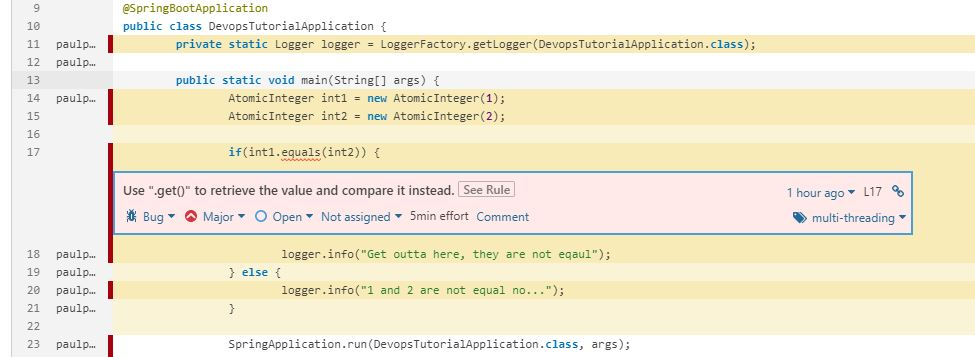

# Tutorial - Adding an automated repair tool to your Jenkins Pipeline

In this tutorial you will learn how to add an automated repair tool to your Jenkins Pipeline. Don't have a Pipeline yet? Don't worry we'll go through every step to set you up.

## What you'll learn?

- You will learn some basic Docker scripting.
- You will learn how to setup your basic Jenkins using docker.
- You will learn how to add plugins to your Jenkins pipeline. SonarQube and Repairnator in this case.
- You will learn some pipeline building using jenkinsfiles in your code repository.

## Outline

You will setup parts of a ci/cd pipeline containing jenkins and sonarqube
using docker. This will be connected to a github repository and you will add a plugin which runs automated code repair on the code.


## Prerequisites

- Docker

To minimize the complexity of many prerequisites, we'll be using Docker in this tutorial to setup our pipeline. Docker enables us to boot-up and run all our components of our pipeline in containers, avoiding installing a lot of dependencies on our local machines.

Here you can find and install a docker version suiting you [Get Docker](https://docs.docker.com/get-docker/)

## Setup our pipeline

Assuming you've installed Docker let's move on to getting our jenkins with sonarqube up and running.

### Tidy up our Docker environment

If you already got a docker installation with some containers already running you should either stop your current containers or make sure that the ports are not colliding throughout this tutorial.

```shell
docker ps       // List our containers
docker stop <my_container>      // Stop any container using their name
docket rm <my_container>        // Removes the container
```

### Start up Jenkins

**Disclaimer:** I've only tested the installation using Windows

<details>
<summary>Installing on macOS and Linux</summary>

1. Create a bridge network in Docker which all our applications will connect to:

```shell
docker network create jenkins
```

<details>
<summary>More on networks</summary>

Containers on docker are exposed on a specific port from the main gateway docker creates. Networks in docker enables containers to communicate with each other with out leaving the docker network. If you boot-up many containers where you want to enable communication between only some of them, you can segregate them by having multiple networks in your docker environment and connecting the containers to different networks. 
</details>

2. Create volumes to persist the jenkins data if you start/stop the containers and so that Jenkins can get a hold of Docker client TLS certificates can be shared which will be used by jenkins 

```shell
docker volume create jenkins-docker-certs
docker volume create jenkins-data
```

<details>
<summary>More on volumes</summary>

Volumes are used by docker as a memory slot. They are persisted over start/stop/restart of containers and may also be shared between multiple containers.

</details>

3. To be able to run Docker commands inside of our Jenkins nodes we need to download and run the Docker in Docker image (DinD).

```shell
docker container run --name jenkins-docker --rm --detach \
  --privileged --network jenkins --network-alias docker \
  --env DOCKER_TLS_CERTDIR=/certs \
  --volume jenkins-docker-certs:/certs/client \
  --volume jenkins-data:/var/jenkins_home \
  --volume "$HOME":/home docker:dind
```

4. Finally we'll download and run the jenkins application

```shell
docker container run --name jenkinsci --rm --detach \
  --network jenkins --env DOCKER_HOST=tcp://docker:2376 \
  --env DOCKER_CERT_PATH=/certs/client --env DOCKER_TLS_VERIFY=1 \
  --volume jenkins-data:/var/jenkins_home \ 
  --volume jenkins-docker-certs:/certs/client:ro \
  --volume "$HOME":/home \ 
  --publish 8080:8080 jenkinsci/blueocean
```

**Note:** as you can see there are some environment variables defined in the run command, these enable the jenkins to actually run the docker in docker commands.

</details>

<details>
<summary>Installing on Windows</summary>

1. Create a bridge network in Docker which all our applications will connect to:

```shell
docker network create jenkins
```

<details>
<summary>More on networks</summary>

Containers on docker are exposed on a specific port from the main gateway docker creates. Networks in docker enables containers to communicate with each other with out leaving the docker network. If you boot-up many containers where you want to enable communication between only some of them, you can segregate them by having multiple networks in your docker environment and connecting the containers to different networks. 
</details>

2. Create volumes to persist the jenkins data if you start/stop the containers and so that Jenkins can get a hold of Docker client TLS certificates can be shared which will be used by jenkins 

```shell
docker volume create jenkins-docker-certs
docker volume create jenkins-data
```

<details>
<summary>More on volumes</summary>

Volumes are used by docker as a memory slot. They are persisted over start/stop/restart of containers and may also be shared between multiple containers.

</details>

3. To be able to run Docker commands inside of our Jenkins nodes we need to download and run the Docker in Docker image (DinD).

```shell
docker container run --name jenkins-docker --rm --detach ^
  --privileged --network jenkins --network-alias docker ^
  --env DOCKER_TLS_CERTDIR=/certs ^
  --volume jenkins-docker-certs:/certs/client ^
  --volume jenkins-data:/var/jenkins_home ^
  --volume "%HOMEDRIVE%%HOMEPATH%":/home ^
  docker:dind
```

4. Finally we'll download and run the jenkins application

```shell
docker container run --name jenkinsci --rm --detach ^
  --network jenkins --env DOCKER_HOST=tcp://docker:2376 ^
  --env DOCKER_CERT_PATH=/certs/client --env DOCKER_TLS_VERIFY=1 ^
  --volume jenkins-data:/var/jenkins_home ^
  --volume jenkins-docker-certs:/certs/client:ro ^
  --volume "%HOMEDRIVE%%HOMEPATH%":/home ^
  --publish 8080:8080 --publish 50000:50000 jenkinsci/blueocean
```

**Note:** as you can see there are some environment variables defined in the run command, these enable the jenkins to actually run the docker in docker commands.

</details>


It might take a while until the jenkins server is up and running. You should however be able to visit http://localhost:8080/ and see your jenkins application when it is ready.

Jenkins now tells us to find our password in the file `/var/jenkins_home/secrets/initialAdminPassword` to unlock it. Either we could use the `exec` command which lets us use any shell command towards a container we would like. We could also check the logs of the jenkins container:

```
docker exec jenkinsci cat var/jenkins_home/secrets/initialAdminPassword
```

```
docker logs jenkinsci
```

1. Use the password to unlock the Jenkins application
2. Follow the installation guide and install the suggested plugins
3. Create a new admin account, e.g. using `user: admin`, `pwd: admin` and some dummy email.

### Start up SonarQube

Assuming you've followed the guide for starting up Jenkins you should have a network called `jenkins` which we will connect our SonarQube application to:

```shell
docker run -d --name sonarqube --network jenkins -p 9000:9000 sonarqube:lts 
```

<details>
<summary>More about `docker run` command</summary>
The `docker run` command starts up an application in a container. The -d flag stands for detach which makes the container run in the background. At the end we define which Image we want to use, in this case "sonarqube:lts". If there is no image present locally matching this name, docker will try and pull it from dockerhub.

</details>

You should be able to go to http://localhost:9000/ and see your sonarqube instance.

If you have issues reaching the application it is either still being started or you might be using a quite old computer or setup with docker.
In my case hitting the wall when trying it out on an old mac(read: "very old"). I had to visit http://192.168.99.100:9000/ since the legacy **Docker Toolbox** runs with VirtualBox which used this ip-adress.


After successfully following the start up guides we should see three containers up and running using the `docker ps` command. Looking something like this:


### Configure Jenkins

We'll now configure jenkins so that we can run a build which executes a sonarqube scan on our files.

#### Install SonarQube scanner plugin

1. Click `Manage Jenkins`->`Manage Plugins`->`Available`
2. Search for `Sonarqube scanner`
3. Tick the box for the tool and then click the `Install without restarting`
4. On the next screen tick the box for restarting the Jenkins when the installation is done and no jobs are running.

#### Configure the SonarQube scanner 

1. When the system has rebooted go back to `Manage Jenkins` again
2. This time click the `Configure (System)`
3. Scroll down to the SonarQube Servers section and click the `Add SonarQube`
4. Here you can specify your SonarQube server adress, name and auth-token
5. In our case running sonarqube on the same docker network as our jenkins we can use the command `docker inspect sonarqube` and in this json structure find the `Networks->Jenkins->IpAddress` and put the value in the URL, in my case it was: `http://172.18.0.4:9000/`
6. Generate token for Sonarqube
  * [Go to your SonarQube instance](http://localhost:9000/) - localhost:9000
  * Now login to the SonarQube using `username: admin` and `pwd: admin`
  * Click on the user icon at the top right corner and click `my account`
  * Click `Security` -> fill in the Token name: `My-SonarQube-Tutorial-Token` -> `copy` the generated token.
7. Add the token to our Jenkins
  * Back in Jenkins click the Add-button next to the "Server Authentication Token"
  * Set `Kind` to `secret text` and add the paste the copied token into the `secret` input field. 
  * Add any name and description of your liking.


## Build our application

Our pipeline is done and we're now ready to make our first build!

We'll be doing so by forking this repository and adding a new Jenkinsfile to it which will define what our builds should do.

### Fork this repository

At the top of this page you can fork this repository:


### Create your own Jenkinsfile

Your jenkinsfile will tell Jenkins how to build your code in the given folder.
Go to the root of the repository and create the file:

```shell
touch Jenkinsfile
```

Now open the Jenkinsfile and add the following:

```
pipeline {
    agent {
        docker {
            image 'maven:3-alpine'
            args '-v /root/.m2:/root/.m2'
        }
    }
    stages {
        stage('Test Maven') {
            steps ('Check maven version') {
                sh 'mvn -version'
            }
        }
    }
}
```

To begin with, we'll check if our maven used with docker is working, this you can see in the `stages -> stage -> steps -> sh 'mvn -version'` section.
The agent part of the json file defines the node which will run the commands, here being a docker container running the image maven:3-alpine.

Now you should `git add .`, `git commit -a -m "Added first Jenkinsfile"` and `git push` your changes.

### Create your build on Jenkins

1. Back to jenkins `"add new item" -> Enter an item name -> choose Pipeline -> click OK at the bottom`.

2. Scroll down to pipeline and change the definition to: `Pipeline script from SCM`, choose `GIT` as your SCM, put the url to your forked repository and save.

3. On the left hand side you should now see and click `start build now`.

4. Refresh the page and you'll see a blinking dot with `#1` on the left hand-side under `Build History`, click on the number and then click Console Output.

You've now initialized your build and can see the console output from the pipeline.
If successful we can carry on, otherwise something is incorrectly configured and you'll have to revisit previous steps, google similar issuer or contact me.

### Now we'll run a build testing that our sonar setup is working

Edit the Jenkinsfile and make the following changes:

```
pipeline {
    agent {
        docker {
            image 'maven:3-alpine'
            args '-v /root/.m2:/root/.m2'
        }
    }
    stages {
        stage('Sonarscan') {
            steps{
                withSonarQubeEnv('SonarQube') {
                    sh "mvn clean package sonar:sonar"
                }
            }
        }
    }
}
```

If successful you should be able to visit your local sonarqube host and see that a new project is showing with some possible issues.

Navigate to the bug clicking on `the project name -> the number of bugs -> the clickable red dscription of the bug`.

Sonarqube now shows you what exactly is the issue and where in the code. You can further dig deeper into how it could possibly be solved by clicking the `see rule` box. In this case I chose quite a simple bug which also already has a functioning code repair tool for it. Should look something like this:



## Time for some Automated Code Repair!

We'll be using a tool called repairnator which enables the user to choose from a variaty of modules conducting repair on your code.

### Add repairnator as a plugin to your jenkins

1. Go to `Manage Jenkins -> Manage Plugins`
2. Click on the `Advanced`-tab.
3. Choose upload file and find the .hpi file in the root of this repository. (Extra credit to the team behind with [link to the tool](https://github.com/eclipse/repairnator/blob/master/doc/repairnator-jenkins-plugin.md) and possible updated version.)
4. Tick the box for restarting Jenkins and wait until it's all finished.

### Configure your pipeline job adding a repairnator job

Now the idea behind the repairnator is to scan through your code for possible bugs and solutions to these and then create a PR to your Github repository with the suggested solution to the bug.

1. Firstly, go back to jenkins main screen and create a new item, now using the `freestyle project` module.
2. In here you can add the URL to your repository if you click the `Git` radio button under version management.
3. Click the `Add post-build action`, and choose `run repairnator` from the given list.
4. Now you will have to generate a GitOAuthToken if you do not have one. You can go to [this link](https://github.com/settings/tokens), press `generate new token` and tick the "public_repo" box.
5. Now you can choose which repairtools to run, and if you want to get a Pull Request with the repairs you can click the `advanced`-button and fill in the GitUrl and Branch. If this doesn't work you might have to add the plugin `github pull request builder`.

**There we have it! You've added an automated repair tool to your Jenkins Pipeline!**

## Cleaning up after us

Stop our container:
```
docker container stop <container_name>
```

If you just want to clean up everything dockery:
```
docker system prune --volumes
```

If you would like to be a bit more granular:
```
docker container prune  -- removes all stopped containers.
docker image prune -a  -- removes all images that are not used by any existing container.
docker volumes prune  -- removes all volumes not used by at least one container.
docker network prune  -- removes all networks not used by at least one container.
```

## Credits

* [Repairnator plugin](https://github.com/eclipse/repairnator/blob/master/doc/repairnator-jenkins-plugin.md) - The team behind creating the repairnator and the plugin for jenkins

## Links to relevant tools and research in the field

* [Repairnator](http://www.github.com/eclipse/repairnator) - "Software development bot that automatically repairs build failures on continuous integration."

* [SpoonLabs](http://www.github.com/spoonlabs/) - "The laboratory for Java source code analysis and transformation using Spoon."